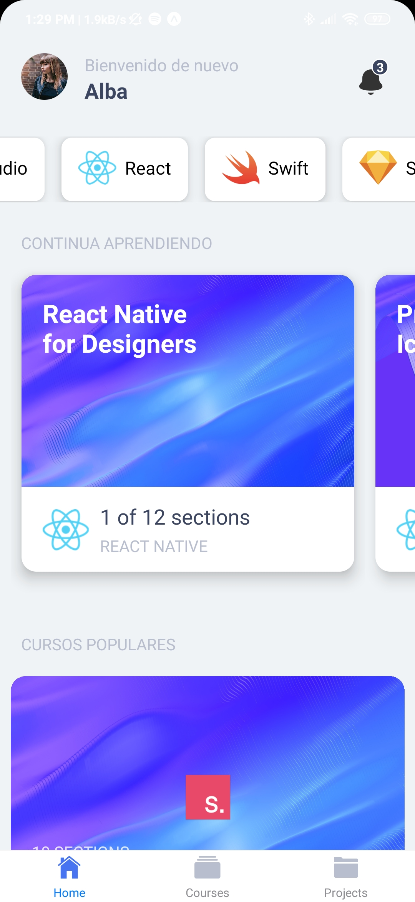
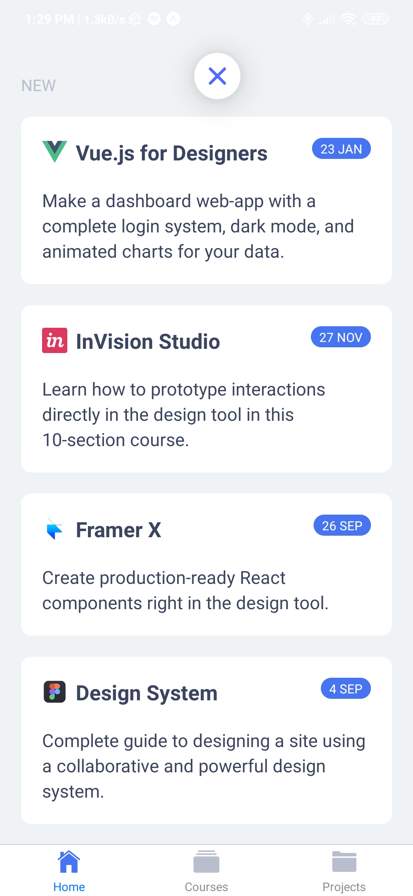
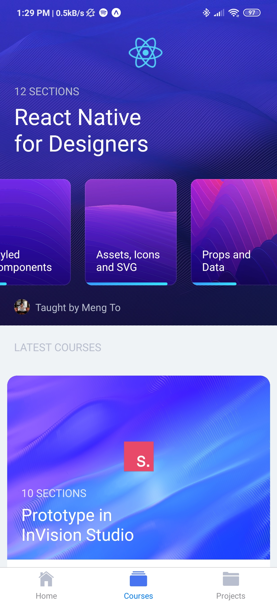
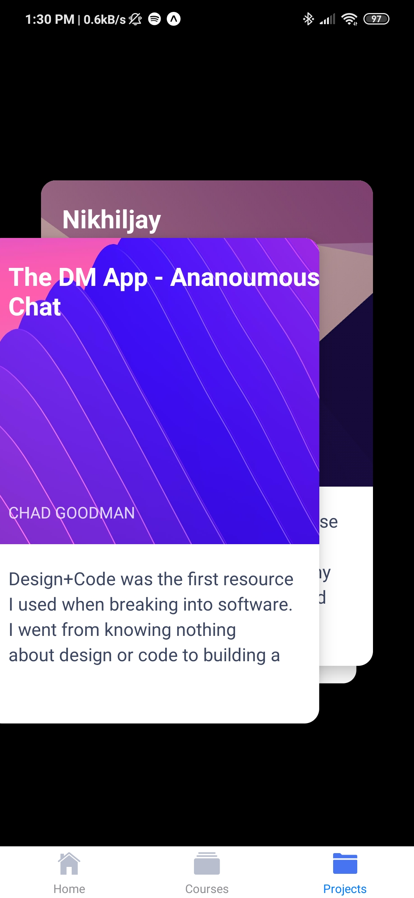
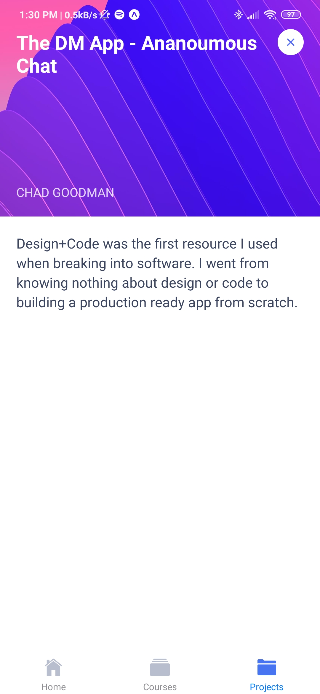
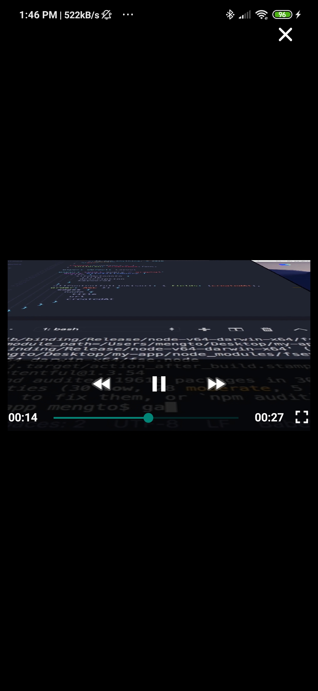

# Desing Code App
Esta aplicación se desarrollo en el curso de Desing Code (en línea) 
## Herramientas 
- React Native
- Expo
- Styled Components
## ¿Qué contiene?
- Login con Firebase
- Uso de Apollo 
- Animaciones con React Native
- Gestos
- Navegación entre pantallas 
- Reproducción de video 
- Uso de modales 
# ¿Cómo probar?
- Clona el repo 
- Instala las dependencias con `npm install`
- ¡Listo! Prueba esta app ;) 

# Screen Shots
## Home

  
  
  

## Courses & Proyects

  
  
  

## Video

  

